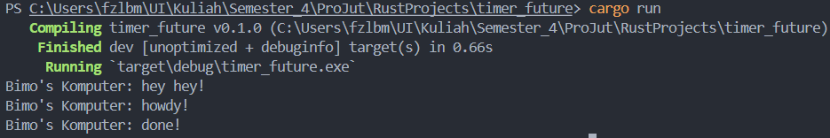

# Tutorial 1 Module 10

1.2. Understanding how it works.

Berdasarkan gambar di atas, `println!("Bimo's Komputer: hey hey");` tereksekusi secara langsung setelah `spawner.spawn(async { ... });`. _Statement_ ini langsung dieksekusi tanpa menunggu _task_ asinkronus di atasnya dieksekusi.

Sementara itu, `async { ... }` yang termasuk di dalamnya `TimerFuture::new(Duration::new(2, 0)).await;`, membuat sebuah _timer_ yang ketika melakukan eksekusi, akan terdapat _delay_ sekitar dua detik. Ini menandakan bahwa setelah program melakukan _print_ "Bimo's Komputer: hey hey", _task_ akan meunggu selama dua detik sebelum program melakukan _print_ "Bimo's Komputer: howdy!" dan "Bimo's Komputer: done!".

