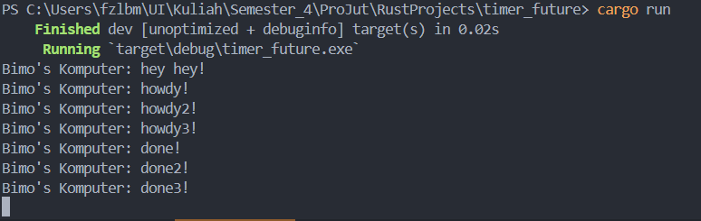
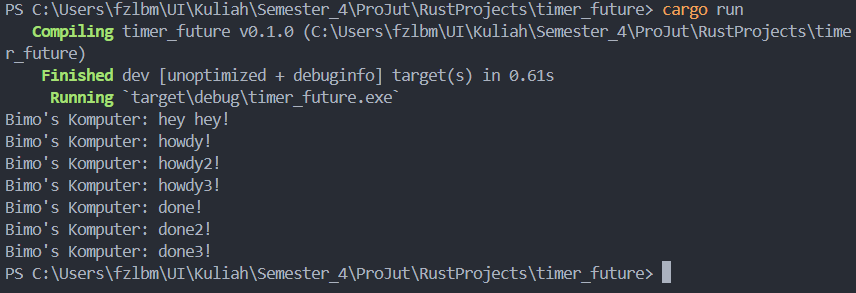

# Tutorial 1 Module 10

1.2. Understanding How It Works.

Berdasarkan gambar di atas, `println!("Bimo's Komputer: hey hey");` tereksekusi secara langsung setelah `spawner.spawn(async { ... });`. _Statement_ ini langsung dieksekusi tanpa menunggu _task_ asinkronus di atasnya dieksekusi.

Sementara itu, `async { ... }` yang termasuk di dalamnya `TimerFuture::new(Duration::new(2, 0)).await;`, membuat sebuah _timer_ yang ketika melakukan eksekusi, akan terdapat _delay_ sekitar dua detik. Ini menandakan bahwa setelah program melakukan _print_ "Bimo's Komputer: hey hey", _task_ akan meunggu selama dua detik sebelum program melakukan _print_ "Bimo's Komputer: howdy!" dan "Bimo's Komputer: done!".

1.3. Multiple Spawn and Removing Drop.

Pada saat `drop(spawner);` dihapus, program tidak berhenti karena _method_ `run` pada `Executor` masih menunggu apabila ada _task_ lagi yang masuk ke `ready_queue`, namun karena `spawner` masih berjalan, hal itu tetap mengirim _task_ dan tidak satu pun yang selesai.

`drop(spawner);` sangat penting karena dapat mengindikasikan bahwa tidak ada lagi _task_ yang bermunculan. Tanpa adanya `drop(spawner);`, `Executor` akan tetap pada `run` _method_-nya untuk menunggu apabila ada _task_ lagi yang perlu dieksekusi dan program tidak akan berhenti karena tidak ada indikasi bahwa _task_ tidak akan muncul kembali.

